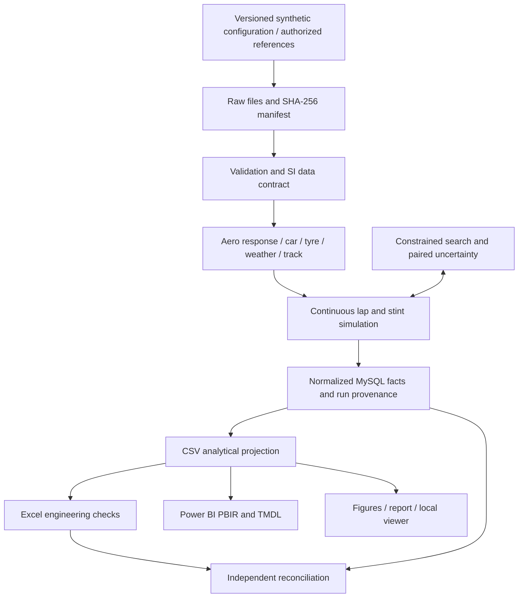

# Architecture

An optimization run has many evaluated candidates. A simulated run links one car, setup, circuit, weather, tyre and session. Vehicle-state samples and segment/sector/lap summaries refer to the run. Input dimension relationships are enforced in MySQL. Power BI facts are flattened only with their parent run keys; no many-to-many fact joins are used.
